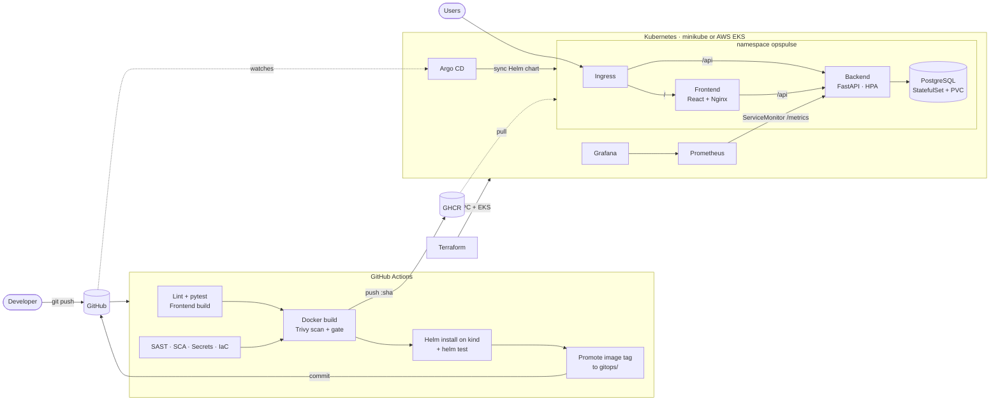
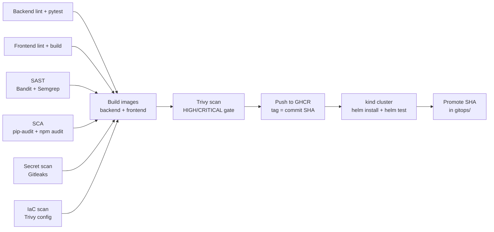

<div align="center">

# OpsPulse

**Incident management and public status page, shipped through a complete DevOps platform.**

[](https://github.com/Chhavi07-arch/OpsPulse-devops-platform/actions/workflows/ci-cd.yml)


</div>

OpsPulse is what an on-call team uses when production breaks: declare an incident, move it through
**Investigating → Identified → Monitoring → Resolved** with a timestamped timeline, see which services
are degraded, track MTTR, and keep customers informed through a public status page with 30-day uptime bars.

The application is the vehicle; the project is the **path from a commit to a monitored Kubernetes
deployment**: tests, security gates, signed-off images, Helm, Terraform-provisioned AWS infrastructure,
Prometheus/Grafana and GitOps with Argo CD.

> Student: **Chhavi Ahlawat** · Enrollment **24BCS10201** · Session 21 — Final DevOps Project

---

## Contents

1. [Architecture](#architecture)
2. [Technologies](#technologies)
3. [Repository layout](#repository-layout)
4. [Application](#application)
5. [Run locally with Docker Compose](#run-locally-with-docker-compose)
6. [Kubernetes and Helm](#kubernetes-and-helm)
7. [Terraform: AWS VPC + EKS](#terraform-aws-vpc--eks)
8. [CI/CD pipeline](#cicd-pipeline)
9. [DevSecOps](#devsecops)
10. [Monitoring and logs](#monitoring-and-logs)
11. [GitOps with Argo CD](#gitops-with-argo-cd)
12. [Troubleshooting challenge](#troubleshooting-challenge)
13. [Screenshots](#screenshots)
14. [Lessons learned](#lessons-learned)

---

## Architecture



**Request path:** browser → Ingress (`/` to the frontend, `/api` to the backend) → FastAPI → PostgreSQL.
**Delivery path:** commit → CI gates → image `:<commit-sha>` in GHCR → CI updates `gitops/` → Argo CD syncs the cluster.

## Technologies

| Area | Tools |
|---|---|
| Frontend | React 19, Vite, React Router, Recharts, Lucide icons, served by unprivileged Nginx |
| Backend | FastAPI, SQLAlchemy 2, Alembic, Pydantic Settings, Uvicorn, prometheus-fastapi-instrumentator |
| Database | PostgreSQL 16 |
| Testing and quality | pytest (+coverage, in-memory SQLite), Ruff, ESLint |
| Containers | Docker multi-stage builds, non-root images, Docker Compose |
| CI/CD | GitHub Actions, GitHub Container Registry, kind |
| DevSecOps | Bandit, Semgrep, pip-audit, npm audit, Gitleaks, Trivy (image + IaC), GitHub code scanning |
| Kubernetes | Helm 3, Deployments, StatefulSet, Services, Ingress (NGINX), HPA, PDB, NetworkPolicy, Pod Security Standards |
| Infrastructure | Terraform, AWS VPC, EKS managed node groups |
| Observability | Prometheus, Grafana, PrometheusRule alerts, JSON structured logs |
| GitOps | Argo CD (AppProject + multi-source Application, auto-sync, self-heal) |

## Repository layout

```text
.
├── application/
│   ├── backend/          FastAPI service, Alembic migrations, pytest suite
│   └── frontend/         React single-page app
├── docker/               Dockerfiles, Nginx template, docker-compose.yml
├── kubernetes/           namespace (Pod Security "restricted") + troubleshooting challenge
├── helm/opspulse/        Helm chart: backend, frontend, postgres, ingress, HPA, monitoring
├── terraform/            AWS VPC + EKS
├── .github/workflows/    CI/CD + DevSecOps pipeline
├── security/             IaC scan config, accepted-risk register, local scan script
├── monitoring/           kube-prometheus-stack values (Prometheus + Grafana)
├── gitops/               Argo CD project/application + per-environment values
└── docs/                 troubleshooting walkthrough and screenshots
```

## Application

**Features:** service catalogue with live health derived from open incidents · incident declaration with
severity (SEV1–SEV4) · audited status timeline · MTTR and 14-day trend · public status page with 30-day
uptime history · dark/light themes · build info (environment + commit SHA) in the sidebar.

**API** (interactive docs at `/docs`):

| Method | Path | Purpose |
|---|---|---|
| GET | `/health` · `/ready` | Liveness · readiness (checks the database) |
| GET | `/metrics` | Prometheus metrics |
| GET | `/api/meta` | Version, environment, Git SHA |
| GET · POST | `/api/services` | List · create services |
| GET · PUT · DELETE | `/api/services/{id}` | Read · update · delete (blocked if it has incident history) |
| GET · POST | `/api/incidents` | List (filters: status, severity, service, active, search) · declare |
| GET · PUT · DELETE | `/api/incidents/{id}` | Detail with timeline · edit · delete |
| POST | `/api/incidents/{id}/updates` | Post a timeline update / change status |
| GET | `/api/stats` | KPIs, MTTR, trend |
| GET | `/api/status` | Public status page data |

**Configuration** is read only from `OPSPULSE_*` environment variables (`application/backend/app/config.py`);
nothing environment-specific is hardcoded. The database password always comes from a secret.

**Tests:** 28 pytest cases across every endpoint, run against an isolated in-memory SQLite database.

```bash
cd application/backend
python -m venv .venv && source .venv/bin/activate
pip install -r requirements-dev.txt
pytest -v --cov=app
```

## Run locally with Docker Compose

```bash
cd docker
cp .env.example .env                      # then set POSTGRES_PASSWORD (openssl rand -hex 16)
docker compose up --build
```

| URL | What |
|---|---|
| http://localhost:3000 | OpsPulse dashboard |
| http://localhost:3000/status | Public status page |
| http://localhost:8000/docs | API documentation |
| http://localhost:8000/metrics | Prometheus metrics |

Both images run as non-root users (backend uid `10001`, frontend uid `101`), install OS security
updates at build time and define health checks. The frontend image is a multi-stage build
(Node build → Nginx runtime); Nginx proxies `/api` to the backend address given in `OPSPULSE_API_UPSTREAM`.

## Kubernetes and Helm

The chart in `helm/opspulse` deploys:

| Object | Details |
|---|---|
| Deployments | backend and frontend, ≥2 replicas, hardened security contexts, read-only root filesystems |
| Init containers | `wait-for-db`, then `migrate` (Alembic, protected by a Postgres advisory lock) |
| Probes | startup + liveness on `/health`, readiness on `/ready` (database check) |
| Services | ClusterIP for backend (8000) and frontend (8080), headless for Postgres |
| Ingress | `opspulse.local`: `/api` → backend, `/` → frontend |
| ConfigMap / Secret | non-secret settings / database password (or an existing Secret) |
| StatefulSet + PVC | PostgreSQL with a 1 Gi volume claim |
| HPA | backend 2–6 and frontend 2–4 replicas at 70% CPU |
| PodDisruptionBudget | keeps at least one replica of each during node maintenance |
| NetworkPolicy | only backend pods may reach PostgreSQL |
| ServiceMonitor, PrometheusRule, dashboard ConfigMap | rendered when the Prometheus Operator is installed |
| Helm test | calls `/ready` and `/api/services` from inside the cluster |

**Deploy to minikube:**

```bash
minikube start --memory=3800 --cpus=4
minikube addons enable ingress
minikube addons enable metrics-server

# build the images on the laptop and load them into the cluster
docker build -t opspulse-backend:local  --build-arg GIT_SHA=$(git rev-parse HEAD) -f docker/backend/Dockerfile .
docker build -t opspulse-frontend:local -f docker/frontend/Dockerfile .
minikube image load opspulse-backend:local
minikube image load opspulse-frontend:local

kubectl apply -f kubernetes/namespace.yaml
helm upgrade --install opspulse helm/opspulse -n opspulse \
  -f helm/opspulse/values-local.yaml \
  --set postgresql.auth.password="$(openssl rand -hex 16)" --wait
helm test opspulse -n opspulse

kubectl get pods,svc,ingress,hpa,pvc -n opspulse
helm list -n opspulse
```

Open it through the Ingress: run `minikube tunnel` in another terminal, add `127.0.0.1 opspulse.local`
to `/etc/hosts`, then browse to http://opspulse.local.

## Terraform: AWS VPC + EKS

`terraform/` provisions a VPC with **two public and two private subnets** across two availability zones
(single NAT gateway), and an **EKS cluster** with a managed node group in the private subnets. The
Kubernetes API is reachable only from the CIDRs in `cluster_endpoint_public_access_cidrs`; a validation
rule rejects `0.0.0.0/0`. All resources carry `Project`, `Owner` and `ManagedBy` tags.

```bash
cd terraform
cp terraform.tfvars.example terraform.tfvars    # set owner and your IP/32
terraform init
terraform plan
terraform apply                                  # ~15 minutes
$(terraform output -raw configure_kubectl)       # point kubectl at EKS
terraform destroy                                # always, after the demo
```

Credentials come from `aws configure`; `terraform.tfvars` and state files are gitignored.
**Cost:** about $0.19/hour while running (EKS control plane, two `t3.small` nodes, NAT gateway).

## CI/CD pipeline

`.github/workflows/ci-cd.yml` runs on every push and pull request to `main`:



| Stage | What fails the build |
|---|---|
| Backend | Ruff lint/format errors, any failing pytest case |
| Frontend | ESLint errors, build errors |
| Security | see [DevSecOps](#devsecops) |
| Images | Dockerfile build errors, fixable HIGH/CRITICAL vulnerabilities |
| Deploy | pods not Ready within 6 minutes, failing `helm test` |

Images are tagged with the full commit SHA (never `latest`), so every running pod can be traced back
to the exact commit. Pull requests run every check but do not push images or deploy.

## DevSecOps

Security runs as parallel jobs; the images are only built if **all** of them pass.

| Layer | Tool | Scope | Gate |
|---|---|---|---|
| SAST | Bandit | Python source | medium+ severity and confidence |
| SAST | Semgrep (`p/default`) | Python, JavaScript, Dockerfiles, YAML | ERROR findings |
| SCA | pip-audit | backend dependencies | any known vulnerability |
| SCA | npm audit | frontend runtime dependencies | high+ |
| Secrets | Gitleaks | the full Git history | any secret |
| IaC | Trivy config | Helm chart, Kubernetes, Terraform, Dockerfiles | HIGH/CRITICAL |
| Containers | Trivy image | both images (OS packages + libraries) | fixable HIGH/CRITICAL |

Trivy results are also uploaded to **GitHub code scanning** (Security tab).

**What Trivy scans and what the result means:** Trivy inventories every OS package in the image (Debian
for the backend, Alpine for the frontend) and every application library, and matches their versions
against vulnerability databases. A clean result means no HIGH or CRITICAL vulnerability with an
available fix is present, because the Dockerfiles apply OS security updates and the dependencies are
current; unfixed findings are reported but do not block, since nothing can be upgraded yet.

The IaC scan found a real issue during development (PostgreSQL without a read-only root filesystem),
which was fixed. Two findings in the EKS module are accepted with written justifications in
[`security/.trivyignore`](security/.trivyignore). Run every gate locally with `security/run-local-scans.sh`.

Runtime hardening: non-root containers, read-only root filesystems, all Linux capabilities dropped,
`RuntimeDefault` seccomp, the namespace enforces the **restricted** Pod Security Standard, and a
NetworkPolicy isolates the database.

## Monitoring and logs

```bash
helm repo add prometheus-community https://prometheus-community.github.io/helm-charts
helm upgrade --install monitoring prometheus-community/kube-prometheus-stack \
  -n monitoring --create-namespace -f monitoring/kube-prometheus-stack-values.yaml
# re-deploy OpsPulse so the ServiceMonitor, alerts and dashboard are created
```

- **Metrics:** `/metrics` exposes HTTP request rate/latency/status plus business metrics
  (`opspulse_active_incidents`, `opspulse_incidents_declared_total`, `opspulse_incidents_resolved_total`,
  `opspulse_incident_resolution_seconds`). A ServiceMonitor makes Prometheus scrape every backend pod.
- **Dashboard:** "OpsPulse — Service Overview" is provisioned automatically: request rate, error rate,
  p50/p95/p99 latency, status codes, active incidents by severity, CPU and memory per pod.
- **Alerts** (PrometheusRule): backend down, error rate above 5%, p95 latency above 1s, SEV1 open.
- **Logs:** one JSON object per line with request ID, method, path, status and duration, e.g.
  `kubectl logs -n opspulse deploy/opspulse-backend | grep '"status": 5'`.

```bash
kubectl port-forward -n monitoring svc/monitoring-kube-prometheus-prometheus 9090   # Prometheus
kubectl port-forward -n monitoring svc/monitoring-grafana 3001:80                     # Grafana
kubectl get secret -n monitoring monitoring-grafana -o jsonpath='{.data.admin-password}' | base64 -d
```

## GitOps with Argo CD

Git is the source of truth for what runs in the cluster. The chart lives in `helm/opspulse`; the
environment-specific values (image tags) live in `gitops/environments/production/values.yaml`, which the
pipeline updates after the images pass every gate. Argo CD watches the repository and reconciles the
cluster; `selfHeal` reverts manual changes and `prune` removes resources deleted from Git.

```bash
kubectl apply -f kubernetes/namespace.yaml
kubectl create secret generic opspulse-db -n opspulse \
  --from-literal=postgres-password="$(openssl rand -hex 16)"     # once; never stored in Git
kubectl apply -f gitops/argocd/project.yaml -f gitops/argocd/application.yaml
```

**Live demo:** change the UI → `git push` → the pipeline builds, scans and promotes the new SHA → Argo CD
syncs → the sidebar shows the new commit.

## Troubleshooting challenge

`kubernetes/troubleshooting/challenge.sh` deliberately breaks the running release in seven ways:
bad image tag, wrong database password, Service selector typo, broken readiness probe, memory limit too
low, unschedulable CPU request and a wrong Ingress backend. Each one is documented in
[`docs/troubleshooting.md`](docs/troubleshooting.md): symptom, investigation, root cause, fix and verification.

```bash
kubernetes/troubleshooting/challenge.sh list
kubernetes/troubleshooting/challenge.sh break 3
kubernetes/troubleshooting/challenge.sh fix 3
```

## Screenshots

Screenshots of every stage are in [`docs/screenshots`](docs/screenshots).

## Lessons learned

- **Security gates catch real things.** The IaC scan flagged a writable Postgres filesystem; dependency
  pins have to be refreshed regularly or the SCA gate fails the build, which is the point.
- **Readiness is not liveness.** `/health` only says the process is up; `/ready` checks the database, so
  Kubernetes stops sending traffic to a replica that cannot serve it instead of restarting it.
- **Migrations need coordination.** Running Alembic in an init container behind a Postgres advisory lock
  avoids races when several replicas start together.
- **Never put secrets in values files.** The chart takes a password at install time or an existing
  Secret, and Gitleaks scans the whole history on every push.
- **Tag images by commit SHA.** It makes rollbacks exact and lets GitOps promote a specific build.
- **Small details break containers.** A tool that looks up the current user fails when the uid has no
  passwd entry; that is why the wait-for-db check passes `-U` explicitly.
- **Resource limits matter on small clusters.** Monitoring, GitOps and the app compete for memory on a
  laptop; requests and limits keep everything schedulable.

## License

[MIT](LICENSE) © 2026 Chhavi Ahlawat
